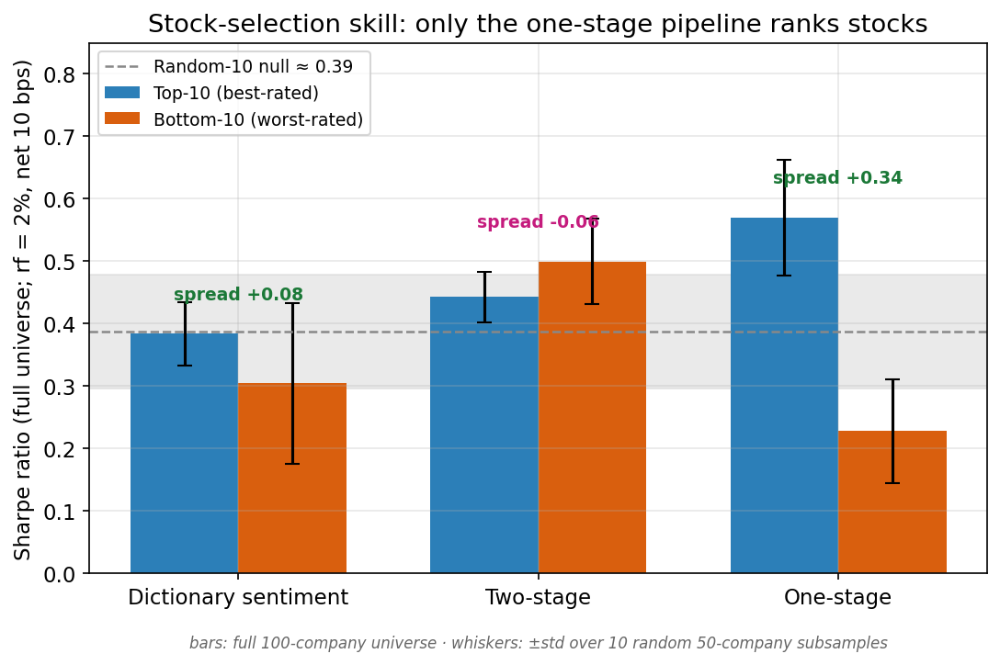
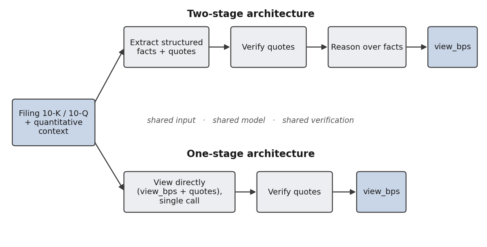
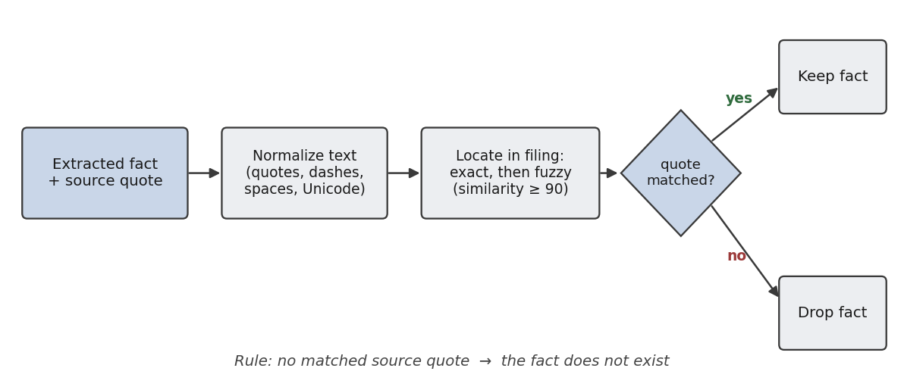
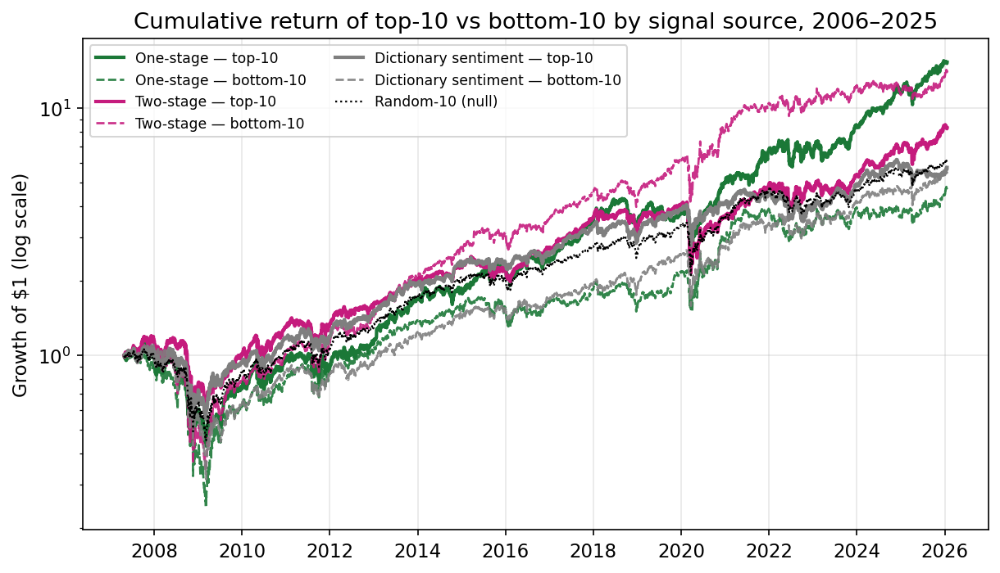
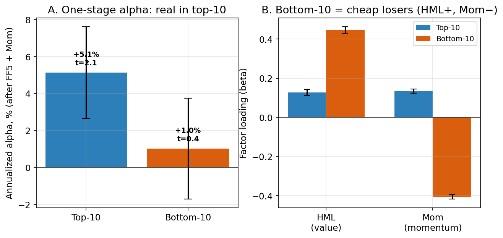

# Comparing LLM Pipeline Architectures for Portfolio Views from Financial Filings

Code, data, and results for the paper **"Comparing LLM pipeline architectures for portfolio
views from financial filings"** (Ivanov O., Kherson State University).

The paper asks a simple engineering question: when a large language model turns an SEC filing
into an investment view, should the pipeline **extract structured facts first and reason over
them** (two-stage), or **produce the view in a single pass** (one-stage)? The common assumption
favors decomposition. Measured head-to-head — same input, same model, same budget, same
fact-verification — the answer is the opposite.



**Only the one-stage pipeline can rank stocks.** Its top-10 portfolio (Sharpe 0.569) beats the
random-selection null, its bottom-10 (0.228) falls below it, and the spread (+0.34) is positive
in all ten random subsamples. The two-stage pipeline and a Loughran–McDonald dictionary
baseline produce no usable ranking. The top ten earn a moderate but factor-robust **+5.1% per
year** (t = 2.07) after controlling for the five Fama–French factors and momentum — and the
one-stage pipeline is also **half as expensive** to run.

## The two architectures



Both read the same input: the parsed filing sections (risk factors, MD&A, liquidity, business;
up to 80k tokens) plus a point-in-time quantitative context (EPS/revenue surprise, analyst
dispersion, momentum, volatility). They differ in exactly one design decision — whether a typed
fact layer sits between the document and the view.

Every fact in both architectures must carry a **verbatim source quote**, which is checked
against the filing text automatically; a fact without a matched quote is discarded
("no source quote — the fact does not exist"):



## Headline results

| Signal source | top-10 Sharpe | bottom-10 Sharpe | spread | spread (10 subsamples) |
|---|---|---|---|---|
| Dictionary sentiment (LM) | 0.384 | 0.304 | +0.08 | −0.01 ± 0.15 |
| Two-stage pipeline | 0.442 | 0.499 | −0.06 | −0.09 ± 0.07 |
| **One-stage pipeline** | **0.569** | 0.228 | **+0.34** | **+0.30 ± 0.08** |

*Full universe of 100 S&P 500 companies, 2006–2025, quarterly rebalancing, Sharpe at rf = 2%,
net of 10 bps round-trip transaction costs.*





The one-stage signal is not a factor bet: after FF5 + momentum controls the top ten retain a
significant alpha (+5.1%, t = 2.07), while the bottom ten are explained by value and negative
momentum loadings (cheap, recently beaten-down stocks). The signal is reproducible across
independent runs (Spearman rank correlation 0.88, sign agreement 94%) and survives doubled
transaction costs.

## Repository layout

```
├── src/                      # shared library
│   ├── extraction/           #   parser, chunker, schemas, prompts, extractor, grounding (quote verification)
│   ├── reasoning/            #   two-stage reasoning step (input builder, reasoner, prompts)
│   ├── singlestage/          #   one-stage architecture (single call: filing -> view)
│   ├── backtesting/          #   backtest engine (top-N / bottom-N / random-N, BL tilt), metrics
│   └── optimization/         #   Black–Litterman, covariance (Ledoit–Wolf)
├── scripts/
│   ├── download_raw_data.py  # market data (FMP API)
│   ├── download_sec_filings.py  # 10-K/10-Q HTML from SEC EDGAR
│   ├── extract_facts.py      # two-stage, stage 1 (with --schema-v2 quote verification)
│   ├── generate_views.py     # two-stage, stage 2
│   ├── run_backtest.py       # backtests
│   ├── factor_attribution.py # FF5 + momentum regressions
│   └── v2/                   # experiment scripts for this paper
│       ├── run_singlestage.py        # one-stage architecture over the corpus
│       ├── run_lm_baseline.py        # Loughran–McDonald dictionary baseline
│       ├── run_model_selection.py    # 8-model comparison on the gold standard
│       ├── eval_extraction.py        # precision/recall/F1 vs gold standard
│       ├── run_reproducibility.py    # extraction stability (3 runs x 90 docs)
│       ├── run_singlestage_repro.py  # one-stage view_bps stability (3 runs x 90 docs)
│       ├── run_calibration.py        # signal calibration (rank-IC, monotonicity)
│       ├── run_placebo_ensemble.py   # random-views placebo & shuffle tests
│       ├── reviewer_recompute.py     # formal t-tests, turnover, cost sensitivity
│       └── make_paper_figures.py     # regenerates the paper figures
├── config/
│   ├── universe.yaml         # the 100 S&P 500 tickers
│   └── config.example.yaml   # API keys template (FMP + OpenRouter)
├── data/
│   ├── views_summary_one_stage.csv     # 8,001 views, one-stage  <- backtests start here
│   ├── views_summary_two_stage.csv     # 8,001 views, two-stage
│   ├── views_summary_lm_sentiment.csv  # 8,001 views, dictionary baseline
│   ├── gold_standard.zip               # 90 hand-annotated documents, 850 events, manifest
│   ├── views_one_stage_full.zip        # per-document one-stage views (JSON, with quotes)
│   ├── views_two_stage_full.zip        # per-document two-stage views (JSON)
│   ├── views_lm_sentiment_full.zip     # per-document dictionary views (JSON)
│   ├── extracted_facts_two_stage.zip   # full extracted-fact layer, 8,001 documents (JSON)
│   └── analysis/                       # measured results (markdown + json)
└── figures/                  # the paper figures
```

## Reproducing the results

**Level 0 — read the measured results.** Everything reported in the paper is in
`data/analysis/`: model selection (`model_eval.md`), the architecture comparison
(`architecture_comparison.md`), the selection test (`cross_sectional_selection_test.md`),
calibration, reproducibility, the dictionary baseline, and the formal statistics
(`reviewer_recompute.json`).

**Level 1 — re-run the backtests (no API keys, no cost).** The three `views_summary_*.csv`
files contain every view for all three signal sources. The backtest, selection test, factor
attribution, and figures are deterministic functions of these files plus market data:

```bash
pip install -r requirements.txt
python scripts/download_raw_data.py            # prices via FMP (free key) — or bring your own price panel
python scripts/run_backtest.py --views-csv data/views_summary_one_stage.csv
python scripts/v2/reviewer_recompute.py        # spreads, t-tests, turnover, cost sensitivity
python scripts/v2/make_paper_figures.py        # regenerates Figs 1-7
```

**Level 2 — re-run the LLM pipelines from raw filings (API costs apply).** Download the
filings, then run either architecture; the corpus cost is ≈$119 (one-stage) / ≈$231
(two-stage) at the prices used in the paper:

```bash
cp config/config.example.yaml config/config.yaml   # add your FMP + OpenRouter keys
python scripts/download_sec_filings.py
python scripts/extract_facts.py --schema-v2 --output-dir data/extracted_v2   # two-stage, stage 1
python scripts/generate_views.py --extracted-dir data/extracted_v2           # two-stage, stage 2
python scripts/v2/run_singlestage.py                                         # one-stage
python scripts/v2/run_lm_baseline.py                                         # dictionary baseline ($0)
```

The model is `google/gemini-2.5-flash` via OpenRouter, temperature 0.1 for extraction and 0.3
for view generation; both prompts are in `src/extraction/prompts.py`, `src/reasoning/prompts.py`,
and `src/singlestage/singlestage.py`.

## Data notes

- **Universe:** 100 S&P 500 companies (GICS-balanced), January 2006 – December 2025; 9,101
  filings, of which 8,001 trigger views. Raw filings and prices are not redistributed here —
  they are downloadable from SEC EDGAR and FMP with the scripts above.
- **Gold standard** (`gold_standard.zip`): 90 documents / 850 events, hand-annotated in a
  two-tier protocol, stratified by sector, period, and form; used for model selection and the
  extraction quality numbers (F1 = 0.39 for the chosen model).
- **Look-ahead discipline:** view date = filing date + 1 day; trades at the next open; only
  data published before the view date is joined.
- All Sharpe ratios and alphas in the paper are net of 10 bps round-trip transaction costs.

## Citation

If you use this code or data, please cite the paper:

> Ivanov, O. Comparing LLM pipeline architectures for portfolio views from financial filings.
> Informatics. Culture. Technology. 2026.

The earlier system on which the two-stage reasoning prompt is based:

> Ivanov, O. & Kobets, V. Future financial impact analysis from sentiment and indicators
> analysis. Computational Economics. 2025; 66(6): 4959–4985.
